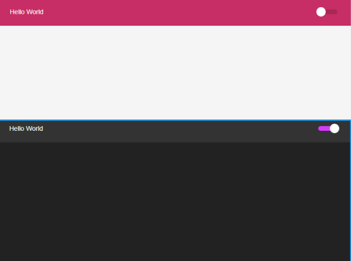

# Alteração de Thema Dark e Light



## Sobre
Alteração de thema claro e escuro

---

## Tecnologia
- styled-components
- react-switch
---

## Como baixar o projeto

```bash 
# Clonar o respositório
$git clone git@github.com:moraes3000/react-thema-dark-light.git

# Entrar no respositório
cd dark-light

# Instalar as dependências
$yarn install

# Iniciar o projeto
$yarn start 
```

